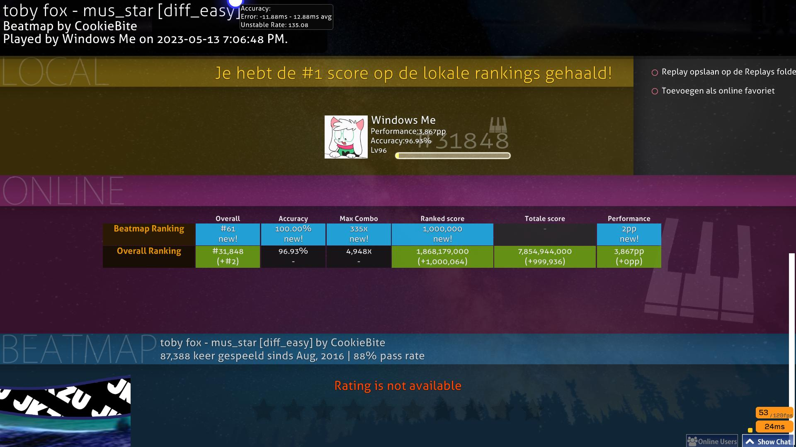

## Mania Score System

The mania ranked score system is confusing, whereas the same score can be different even if the two are set on different maps.

For example, here are two formulas for the same score but with a different result in the "ranked score from recently submitted score" section.

Map 1:
```typescript
current ranked score: 1,000,000,000,000
ranked score from recently submitted score: 999,987
exact score: 1,000,000
updated ranked score: 1,000,000,999,987
``` 
Map 2:
```typescript
current ranked score: 1,000,000,999,987
ranked score from recently submitted score: 1,000,027
exact score: 1,000,000
updated ranked score: 1,000,002,000,014
``` 
The latter's submitted score was exactly 1,000,000, whereas the ranked score given was 999,987, whereas the former's submitted score was the same but awarded 1,000,027.

It is worth mentioning that the same can also happen with the total score.

Map 1:
```typescript
current total score: 1,000,000,000,000
total score from recently submitted score: 1,000,097
exact score: 1,000,000
updated total score: 1,000,000,000,097
``` 
Map 2:
```typescript
current total score: 1,000,001,000,097
total score from recently submitted score: 999,998
exact score: 1,000,000
updated total score: 1,000,000,001,096
total score /w decimals: 1000000001096.998 // doesn't really matter much
``` 

For reference: 